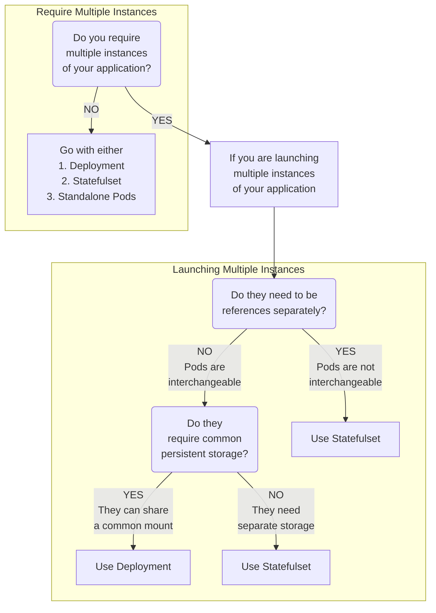
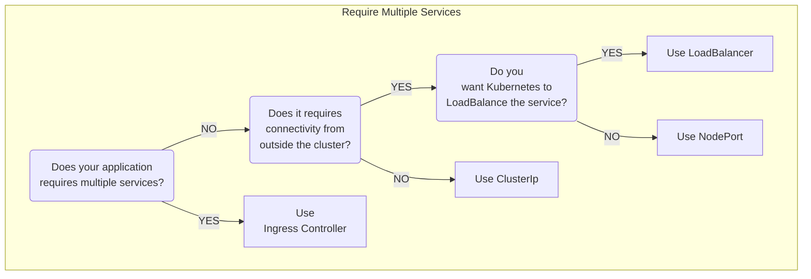

# Kubernetes Terminology

<table>
    <tr>
        <th>Pods</th>
        <td>A container runtime (like Docker) responsible for pulling the container image from a registry, unpacking the
            container, and running the application</td>
    </tr>
    <tr>
        <th>Pods</th>
        <td>A Single Instance of a Container. The Smallest</td>
    </tr>
    <tr>
        <th>Nodes</th>
        <td>Devices used to run containers, akin to VM, Computer</td>
    </tr>
    <tr>
        <th>Deployments</th>
        <td>Deployments is used to manage Pods (Orchestration)</td>
    </tr>
    <tr>
        <th>Ingress</th>
        <td>Nginx Service used to route traffic to Nodes</td>
    </tr>
    <tr>
        <th>Kubelet</th>
        <td>A process responsible for communication between the Kubernetes control plane and the Node; it manages the
            Pods and the containers running on a machine</td>
    </tr>
    <tr>
        <th>Volume</th>
        <td>Place to Store Data</td>
    </tr>
    <tr>
        <th>Cluster</th>
        <td>A Kubernetes cluster is a collection of nodes that run containerized applications. </td>
    </tr>
    <tr>
        <th>Control plane</th>
        <td>It manages the distribution of applications across the cluster, scaling, failover, and deployment patterns.
        </td>
    </tr>
    <tr>
        <th>Service</th>
        <td>Exposes an application running on a set of pods as a network service. Acts as Load Balancer</td>
    </tr>
     <tr>
        <th>Node Port</th>
        <td>Single Node Port 80, Target Port 80, Port on The Node Itself (Range: 30000 - 32767s)</td>
    </tr>
    <tr>
        <th>Docker Swarm</th>
        <td>Docker Swarm is used for orchestration between containers. Considered as lightweight kubernetes. Also has master, slave nodes.</td>
    </tr>
    <tr>
        <th>Docker Netowrk</th>
        <td>Docker Network is used to bridge 2 containers within the same network, allowing containers to communicate</td>
    </tr>
</table>

# Imperative Way

```sh
kubectl run nginx --image=nginx
```

# Declarative Way

FileName: `pod-definition.yml`

```yaml
apiVersion: v1
kind: Pod
metadata:
    name: myapp-pod
    labels:
        app: myapp
        type: front-end
spec:
    containers:
    - name: nginx-container
      image: nginx
```

# Api Replica Set

```yaml
apiVersion: apps/v1
kind: ReplicaSet
metadata:
    name: myapp-replicaset
spec:
    template:
        metadata:
            name: httpd-frontend
            labels:
                app: httpd-frontend
                type: front-end
        spec:
            containers:
            - name: httpd-frontend
              image: httpd:2.4-alpine
    replicas: 3
    selector:
        matchLabels:
            type: front-end
```

# Deployments

```yaml
apiVersion: apps/v1
kind: Deployment
metadata:
    name: httpd-frontend
spec:
    template:
        metadata:
            name: httpd-frontend
            labels:
                app: httpd-frontend
                type: front-end
        spec:
            containers:
            - name: httpd-frontend
              image: httpd:2.4-alpine
    replicas: 3
    selector:
        matchLabels:
            type: front-end
```

# Services

```yaml
apiVersion: v1
kind: Service
metadata:
    name: redis-db
spec:
    type: ClusterIp
    ports:
    - targetPort: 6379
      port: 6379
    selector:
        app: myapp
        name: redis-pod
```

# Node Port Services

```yaml
apiVersion: v1
kind: Service
metadata:
    name: web-service
spec:
    type: NodePort
    ports:
    - targetPort: 6379
      port: 6379
      nodePort: 30008
    selector:
        app: myapp
        type: front-end
```

# Decision to Use ClusterIp, NodePorts, LoadBalancer





## References

[Kubernetes CheatSheet](https://www.bluematador.com/learn/kubectl-cheatsheet)
[Kubernetes How to Expose Localhost](https://medium.com/digitalfrontiers/kubernetes-ingress-with-nginx-93bdc1ce5fa9)
[Kubernetes Expose Localhost with Ingress Controller](https://platform9.com/learn/v1.0/tutorials/nginix-controller-via-yaml)
[Kubernetes Do Localhost Nginx in BareMetal](https://raw.githubusercontent.com/kubernetes/ingress-nginx/controller-v1.1.1/deploy/static/provider/baremetal/deploy.yaml)
