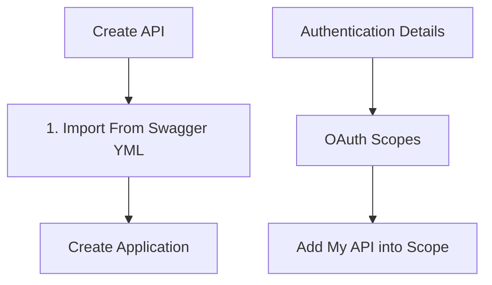

# Notes

## Tasks

- [x] Software AG
  - [x] Create New API
  - [x] Setup Custom Endpoints
  - [x] Access API from 3rd party account
  - [x] Setup Basic Authorization for API
    - [x] Setup ApiKey
      - [x] Link To Application
    - [x] Setup OAuth (Hard) (Requires Docker)
  - [x] Setup Basic Policies for API
  - [ ] What is Request Transformation?
    - [ ] Custom Payload Transformation
  - [x] What is Response Transformation?
    - [x] Enable CORS
    - [x] Show Custom Headers
  - [x] What is Application in Software AG
    - [x] Application is used to generate RequestAuth Key
  - [x] Publish API To Server
    - [x] Update Image
  - [x] What are scopes in Software AG
    - [x] Local Scope is used for OAuth
  - [ ] Install Ingress Certificate

## Software AG APIGateway

- Design and Build
  - API Creation with RAML/Swagger/OPEN API
  - Policy Details
    - Authorization (OAuth, Basic, JWT, API Key, External OAuth)
    - Validation
    - Request Transformation
    - Logging
    - Response Transformation
    - Error handling
- Global Policies & Threat Protection
  - Global Policy
    - Transactions Logs
    - Global Error
  - Threat Protections
- Analytics & Dashboards

## Request OAuth

[Request OAuth](https://env280753.int-aws-de.webmethods.io/integration/rest/oAuth/authorize?client_id=b25fb6ffcb7e4829b294b15a759b3a5e&redirect_uri=https://www.google.com/redirect&response_type=code&state=121)

## Training

- [x] [API Management Basic](https://learn.softwareag.com/course/view.php?id=1577)
- [x] [webMethods API Management Essentials](https://learn.softwareag.com/course/view.php?id=1787)
- [x] [OAuth Authentication Setup](https://documentation.softwareag.com/webmethods/api_gateway/yai10-15/webhelp/yai-webhelp/index.html#page/yai-webhelp/ta-oauth_local_oauth_server.html)
- [x] [Retrieve OAuth Token](https://documentation.softwareag.com/webmethods/api_gateway/yai10-15/webhelp/yai-webhelp/index.html#page/yai-webhelp/ta-retrieve_oauth_token.html)
- [x] [Retrieve JWT Token](https://documentation.softwareag.com/webmethods/api_gateway/yai10-15/webhelp/yai-webhelp/index.html#page/yai-webhelp/ta-retrieve_json_bearer_token.html)\
- [x] [API Management 10.11 Delta Training](https://learn.softwareag.com/course/view.php?id=1598)
- <https://mubarikahmed.wordpress.com/2023/03/26/how-to-enable-cors-in-webmethods-api-gateway/>
- <https://mubarikahmed.wordpress.com/2022/12/13/configure-jwt-in-webmethods-is/>
- <https://mubarikahmed.wordpress.com/2022/12/04/configuring-oauth-in-webmethods-is/>
- <https://mubarikahmed.wordpress.com/2022/11/22/add-certificate-to-truststore-in-webmethods/>
- <https://mubarikahmed.wordpress.com/2022/11/22/how-to-setup-keystore-in-webmethods/>

## Training (AIA)

### Session 1 - Server Patching

- [Link](https://tss-confluence.aiaazure.biz/display/TSSFSBAU/Session+1+-+Server+Patching)
- [x] [Vid 1](https://aiacom.sharepoint.com/:v:/r/sites/TSSFirestormBAU/Shared%20Documents/General/02%20KT%20session/KT%20recordings%20-%202024/Session%201%20Server%20patching_part%201%20SIT%20%26%20UAT.mp4?csf=1&web=1&e=PfrymZ)
- [x] [Vid 2](https://aiacom.sharepoint.com/:v:/r/sites/TSSFirestormBAU/Shared%20Documents/General/02%20KT%20session/KT%20recordings%20-%202024/Session%201%20Server%20patching_part%202%20PROD%20%26%20DR.mov?csf=1&web=1&e=PTKWSc)

### Session 3 - Ingress Cert Renewal

How to Generate CSR, SSL Certs\
Store in BitBucket\
Update with Jenkins Pipeline\
Updates Kubernetes

- [Link](https://tss-confluence.aiaazure.biz/display/TSSFSBAU/Session+3+-+ingress+cert+renew)
- [x] [Vid 1](https://aiacom.sharepoint.com/:v:/r/sites/TSSFirestormBAU/Shared%20Documents/General/02%20KT%20session/KT%20recordings%20-%202024/Session%203%20-%20ingress%20cert%20renew%20part%201.mov?csf=1&web=1&e=Xs2xyT)
- [x] [Vid 2](https://aiacom.sharepoint.com/:v:/r/sites/TSSFirestormBAU/Shared%20Documents/General/02%20KT%20session/KT%20recordings%20-%202024/Session%203%20-%20ingress%20cert%20renew%20part%202.mov?csf=1&web=1&e=wbD7mx)
- [x] [Vid 3](https://aiacom.sharepoint.com/:v:/r/sites/TSSFirestormBAU/Shared%20Documents/General/02%20KT%20session/KT%20recordings%20-%202024/Session%203%20-%20ingress%20cert%20renew%20part%203.mov?csf=1&web=1&e=uxJWBU)

### Session 4 - Swagger File

Software AG API Management

- [Link](https://tss-confluence.aiaazure.biz/display/TSSFSBAU/Session+4+-+Swagger+file)
- [x] [Vid 1](https://aiacom.sharepoint.com/:v:/r/sites/TSSFirestormBAU/Shared%20Documents/General/02%20KT%20session/KT%20recordings%20-%202024/Session%204%20-%20Swagger%20file.mov?csf=1&web=1&e=CPYA6x&isSPOFile=1) *Has Software AG Tutorial*

### Session 5 - Adding New Ingress

Check New SSL Ingress Certs using Kubernetes\
Update Ingress Certs using Jenkins Pipeline

- [Link](https://tss-confluence.aiaazure.biz/display/TSSFSBAU/Session+5+-+Adding+new+ingress+API+on+API+gateway)
- [x] [Vid 1](https://aiacom.sharepoint.com/:v:/r/sites/TSSFirestormBAU/Shared%20Documents/General/02%20KT%20session/KT%20recordings%20-%202024/Session%205%20-%20Adding%20new%20ingress%20API%20on%20API%20gateway.mov?csf=1&web=1&e=dGjpRo)

### Session 6 - Create New Api on APIGW

Software AG API Management

- [Link](https://tss-confluence.aiaazure.biz/display/TSSFSBAU/Session+6+-+Create+new+API+on+API+gateway)
- [x] [Vid 1](https://aiacom.sharepoint.com/:v:/r/sites/TSSFirestormBAU/Shared%20Documents/General/02%20KT%20session/KT%20recordings%20-%202024/Session%206%20-%20Create%20new%20API%20on%20API%20gateway.mov?csf=1&web=1&e=wCKLAH)

## Additional Resources

- [Using WebMethods API Gateway](https://medium.com/@heymentari/webmethods-apigateway-begginner-starter-pack-using-webmethods-api-gateway-f5853dd979dd)
- [WebMethods API Gateway Basic : Authentication and Authorization](https://medium.com/@heymentari/webmethods-api-gateway-basic-authentication-and-authorization-436d02589848)
- [Building an integration microservice from A to Z with webMethods and Kubernetes](https://tech.forums.softwareag.com/t/building-an-integration-microservice-from-a-to-z-with-webmethods-and-kubernetes/267171)
- [SoftwareAG/webmethods-api-gateway](https://github.com/SoftwareAG/webmethods-api-gateway)
- [Protecting Resource APIs with API Scopes](https://medium.com/api-center/protecting-resource-apis-with-api-scopes-4f0e819763d7)
- [SoftwareAG/webmethods-api-gateway-devops](https://github.com/SoftwareAG/webmethods-api-gateway-devops)

## Flow Chart

*API Publish to Public Community*

## Table

<table>
  <tr>
    <th>Title</th>
    <th>Description</th>
    <th>Objective</th>
    <th>Scenario</th>
    <th>Example</th>
  </tr>
  <tr>
    <th>Straight Through Routing</th>
    <td>Use STR Policy to ensure minimal latency and overhead</td>
    <td>Expose existing backend services through an API with minimal complexity. AKA Send data directly to API without any extra processing </td>
    <td>Optimize traffic flow between multiple zones without data processing</td>
    <td>In fast networks like data centers, STR minimize latency and overhead. Suits applications that require low latency and high throughput. E.g. Real-Time Video Streaming, Online Gaming, Financial Trading</td>
  </tr>
  <tr>
    <th>Conditional Routing</th>
    <td>Use CR policy to handle data differently based on conditions</td>
    <td>Send incoming requests to different backend resources based on conditions</td>
    <td>Handle sensor data from various devices based on different conditions</td>
    <td>Smart Agriculture System, Sensor monitor soil mositure levels across different fields. CR direct data from sensor detecting low moisture levels to irrigation systems for immediate action</td>
  </tr>
  <tr>
    <th>Load Balancer Routing</th>
    <td>Use LBR policy to evenly distribute incoming requests across servers</td>
    <td>Distribute incoming network traffic evenly across multiple servers or resources to optimize resource ultilization and improve system performance</td>
    <td>Handle high volumes of incoming requests in a web hosting environment</td>
    <td>Peak shopping seasons, e-commerce platform use load balancer routing to distribute traffic across servers, prevent overload and enhance performance</td>
  </tr>
  <tr>
    <th>Outbound Auth - Transport</th>
    <td>Use OAT policy to authenticate outgoing requests</td>
    <td>Ensure secure communication between API Gateway and backend systems by including authentication creds within transport headers</td>
    <td>Integration with legacy systems or third-party APIs requiring transport-level auth</td>
    <td>Enterprise application interacts with legacy backend protected by Basic Authentication</td>
  </tr>
  <tr>
    <th>Outbound Auth - Message</th>
    <td>Use OAM policy to embed auth creds within message payload for secure communication with APIs</td>
    <td>Embed auth creds within payload message of outgoing requests to satisfy requirements of native API</td>
    <td>In instances where APIs mandate auth creds within message payload</td>
    <td>An application needs to interact with a third-party service secured with SAML-based authenitcation</td>
  </tr>
  <tr>
    <th>JMS / AMQP Routing</th>
    <td>Use JMS / AMQP policy to route requests between two environments</td>
    <td>Seamless communication between legacy system using JMS queue and modern RESTful API</td>
    <td>Modernize service by giving RESTful API for order placement. Maintain compatibility with legacy JMS-based communication</td>
    <td>Legacy system communicates through JMS queue for order processing. Modernize service by providing RESTful API for order placement. Acts as bridge between legacy system and RESTful API. Ensure smooth transition and compatibility</td>
  </tr>
</table>

## TerraCotta

- Will Load Balancer
- API Gateway Load Balancer

There's 2 things fking me up

- Business Knowledge, SIT, UAT, PROD
- DevOps Knowledge, SoftwareAG

*What is API Scope?*\
Does this particular user have a right to see the requested data?

Scope is an mechanism in OAuth 2.0 to limit application's access to user's account.\
An application can request one or more scope.\
Access Token is issued to application and will be limited to scopes granted.

I Should be restricting an app READ or WRITE access using APIs\
For Example, I should classify an App WRITE Function to one REST Apis\
Then, I Should Classify the app READ Function to another REST APIs\

Using Scope, I can then restrict my user access to different REST APIs, that I have classified.\
The above scenario I Should have 2 REST Apis.

An OAuth can have 1 to many access.

[Back To Homepage](./index.md)
